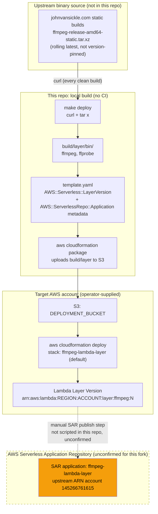
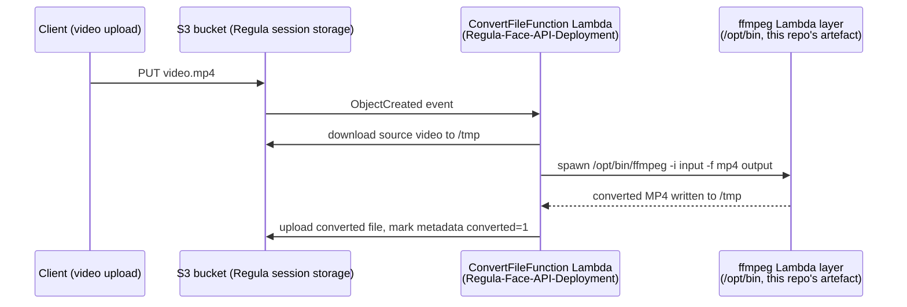

# Architecture

This document describes how the FFmpeg Lambda layer in this repository is **built, packaged, published,
and consumed** — there is no request-processing runtime of its own to diagram, since the repo's only output
is a Lambda layer version (a `.zip` of static binaries plus CloudFormation/SAR metadata), not a service.

See [CLAUDE.md](../CLAUDE.md) for the full project overview, conventions, and open questions
(in particular the [upstream-vs-fork identity question](../CLAUDE.md#upstream-vs-fork-identity-open-question)
referenced throughout this document).

## Why there is no `failure-scenarios.md`

Several sibling repositories in this org (e.g. `verifime-report-delivery-lambda`,
`risk-assessment-notification-producer-lambda`) pair `architecture.md` with a `failure-scenarios.md`
documenting SQS/SNS retry semantics, DLQ behaviour, and partial-batch failure handling. **That document
doesn't apply here.** This repo has no message queue, no event source mapping, and no runtime request path
of its own — it is a build/publish artefact. There is nothing that "retries" or "redelivers." The failure
modes that actually matter for a repo like this are **build-time** and **publish-time**, not
request-time, so they are covered briefly below instead of in a separate document.

## Build, Package, and Publish Flow

Notes on the diagram:

- The dashed edge into the SAR box reflects that **publishing a new SAR application version is a manual
  step outside this repo's `Makefile`** — `make deploy` only produces a private CloudFormation stack with a
  layer version in whatever account/region the operator targets. Whether this fork has ever actually been
  re-published as Greengate-Fintech's own SAR application (as opposed to consumers using the original
  `serverlesspub`-owned SAR listing, account `145266761615`) is unconfirmed — see
  [CLAUDE.md's open question](../CLAUDE.md#upstream-vs-fork-identity-open-question).
- The FFmpeg binary source is a **rolling "latest static build" URL**, not a version-pinned release archive.
  Two `make deploy` runs on different days can package different FFmpeg versions even though nothing in this
  repo's own source changed — see [Build/publish failure modes](#buildpublish-failure-modes) below.

## Consumption Flow (confirmed real consumer)

The only confirmed consumer of a deployed instance of this layer, found by searching every other repository
in the organisation, is `Regula-Face-API-Deployment`'s video-conversion Lambda. It does not depend on this
repo's source or Git history at all — only on a Lambda layer ARN that already exists in its own AWS
accounts, referenced by convention (see `Regula-Face-API-Deployment/lib/constants.ts:88,109`).

`Regula-Face-API-Deployment` pins a specific layer **version** (`:1`) by ARN
(`lib/regula-face-api-s3-bucket-stack.ts:121-125`, `lib/constants.ts:88,109`) in its own non-prod
(`921483706620`) and prod (`772479554838`) accounts, region `ap-southeast-2`. Publishing a new layer version
from this repo does **not** automatically reach that consumer — it requires a separate CDK change in
`Regula-Face-API-Deployment` to bump the ARN's version suffix. See
[CLAUDE.md § Ecosystem Position](../CLAUDE.md#ecosystem-position) for the full detail and the open question
about how that layer version was originally created (manual `make deploy` vs. a SAR-based deploy).

`example/src/index.js` in this repo demonstrates the same `/opt/bin/ffmpeg` invocation pattern
(thumbnail extraction rather than transcoding) against the example stack's own layer reference — see
[CLAUDE.md § The `example/` directory](../CLAUDE.md#the-example-directory).

## Build/Publish Failure Modes

Since there is no runtime request path, "failure scenarios" for this repo are about the build and publish
steps going wrong, not about message redelivery or retries:

| Failure mode | Cause | Effect | Mitigation in this repo |
|---|---|---|---|
| Unpinned FFmpeg version drift | `Makefile`'s `build/layer/bin/ffmpeg` target always fetches `ffmpeg-release-amd64-static.tar.xz` — a rolling alias for John Van Sickle's latest static build, not a version-numbered URL | A fresh `make deploy` (after `make clean`, or on a machine with no prior `build/`) can silently package a newer FFmpeg than the "4.1.3" documented in `README.md`/`README-SAR.md`/`template.yaml`'s SAR metadata | None currently — this is a real, undocumented-until-now gap; see `CLAUDE.md`'s security note. There is no lockfile/checksum pin |
| Upstream URL unavailability | `curl` to `johnvansickle.com` fails (network issue, upstream site down/restructured) | `make deploy` fails at the `build/layer/bin/ffmpeg` step before anything reaches AWS; no partial/corrupt layer is deployed, since the Makefile target only completes atomically (`mv` at the end) | The `mv` at the end of the target means a failed/interrupted `curl \| tar x` leaves no `build/layer/bin/ffmpeg`, so a subsequent `make deploy` retries cleanly rather than deploying a partial binary |
| No automated tests or CI | No `.github/workflows/`, no test suite | A change to `template.yaml` (e.g. a typo in `CompatibleRuntimes`, a bad `ContentUri`) is only caught by a human running `make deploy` against a real AWS account, or by the eventual consuming Lambda failing at cold start (`Cannot find module`/`ENOENT: /opt/bin/ffmpeg`) | None — this is an accepted trade-off for a low-change-frequency artefact repo, not a gap to "fix" reflexively; any CI addition should be scoped deliberately (see Open Questions) |
| Stale `CompatibleRuntimes` declaration | `template.yaml`'s `CompatibleRuntimes` lists `nodejs10.x`, `python3.6`, `ruby2.5`, `java8`, `go1.x` — all now deprecated/end-of-life Lambda runtimes as of this fork's last edit | AWS Lambda layer compatibility declarations are advisory metadata only (Lambda does not currently enforce them for use, but the console UI surfaces them, and SAR's version-search filters by them) — a consumer on a current runtime (e.g. Node.js 24.x, as `Regula-Face-API-Deployment`'s `ConvertFileFunction` uses) is unaffected in practice, but the declared list no longer reflects reality | None — flagged here so a future SAR republish updates this list rather than perpetuating it unexamined |
| Cross-account ARN drift | A layer version deployed via `make deploy` is account/region-specific (`arn:aws:lambda:REGION:ACCOUNT:layer:ffmpeg:N`) | If this repo is redeployed into a *different* account than a consumer expects (e.g. a new environment), the consumer's hard-coded ARN (see `Regula-Face-API-Deployment/lib/constants.ts`) will not resolve — there is no cross-account/cross-region layer sharing configured anywhere in this repo's `template.yaml` | None — `AWS::Serverless::LayerVersion` here has no `LayerPermission`/cross-account grant resource; if cross-account sharing is ever needed, that is new work, not an existing capability |

## Open Questions

> **TODO(owner):** Whether this fork has ever been published as Greengate-Fintech's own AWS Serverless
> Application Repository listing (with its own account-scoped ARN and `SemanticVersion` lineage), or whether
> all internal consumption to date has been via a one-off `make deploy` direct to a target account (bypassing
> SAR entirely) — see [CLAUDE.md](../CLAUDE.md#upstream-vs-fork-identity-open-question). The confirmed
> consumer's ARN shape (a plain regional Lambda layer ARN, not a SAR application reference) is consistent
> with the latter, but this is not verified against deployment history.

> **TODO(owner):** Whether FFmpeg version pinning (e.g. downloading a specific dated/versioned release archive
> rather than the rolling "latest static build" alias) is worth adding, given the layer is GPL-licensed
> third-party binary content with no automated test coverage of the packaged binaries' behaviour.

> **TODO(owner):** Whether `template.yaml`'s `CompatibleRuntimes` list should be refreshed to current Lambda
> runtimes on the next SAR republish (informational only today, per the failure-mode table above — not
> blocking current usage).
